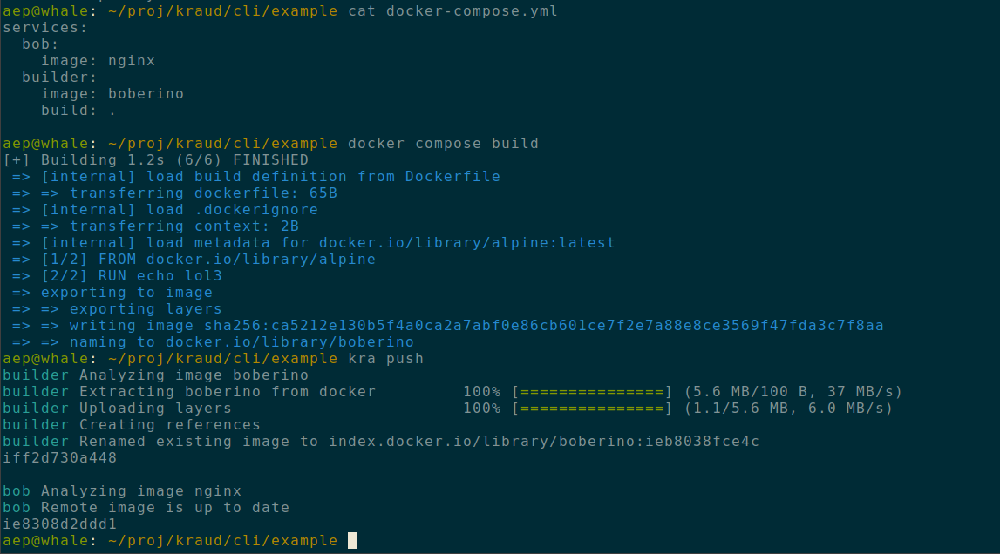

# Introducing the kraud cli: kra

From the beginning of the project we always strived for compatbility with your existing tools, be it docker or kubectl.
Your feedback is always greatly apprechiated, as it helps us clarify what that exactly means in practice.
How much compat is good, and where do the existing tools not work?

We haven't reached a stage where this is entirely clear yet, but the trend is pointing towards

 - Fully supporting the docker cli
 - Building a custom cli to supplement docker
 - Freezing kubectl at 1.24
 - Partially supporting the most popular of the many incompatible docker compose variants


Particularly kubectl is a difficult choice. Kubernetes is a standard. But unfortunately, it's not actually a standard,
and keeping up with upstream does not seem feasible at the moment.

Instead we will shift focus entirely on supporting docker and docker compose.
The compose spec is weird, and inconsistent, but it is simple and hence **very** popular.
Most of the confusion we've seen in practice is easily addressable with better tooling.

### So we are introducing: *kra*

The kra commandline program works on docker-compose files and will implement some of the processes that docker does
not do at all (ingress config currently requires kubectl) or does incorrectly (local file mounts).

Specifically a pain point in some user setups has been CI. Since we don't support docker build yet,
users build on the ci machine and then use docker load. This is slow, because the docker api was never intended to be used remotely.

Instead `kra push` is very fast and should be used in CI instead.


### github CI example

here's a typical `.github/workflows/deploy.yaml`

```yaml
name: Deploy
on:
  push:
    branches: [  main, 'staging' ]
jobs:
  deploy:
    runs-on: ubuntu-latest
    steps:
      - uses: actions/checkout@v3
      - name: 'deploy to kraud'
        env:
          KR_ACCESS_TOKEN: ${{secrets.KR_ACCESS_TOKEN}}
        run: |
          curl -L https://github.com/kraudcloud/cli/releases/latest/download/kra-linux-amd64.tar.gz  | tar xvz
          sudo mv kra /usr/local/bin/

          # get credentials for docker cli
          kra setup docker

          # build the images localy
          docker compose build

          # push images to kraud
          kra push

          # destroy running pod
          # this is currently needed until we fix service upgrades
          docker --context kraud.aep rm -f myapp

          # start new pods with new images
          docker compose up -d

```


kra is open source and available here: [https://github.com/kraudcloud/cli](https://github.com/kraudcloud/cli).
We're aways happy for feeedback. Feel free to open github issues or chat with a kraud engineer on discord.


### screenshot


