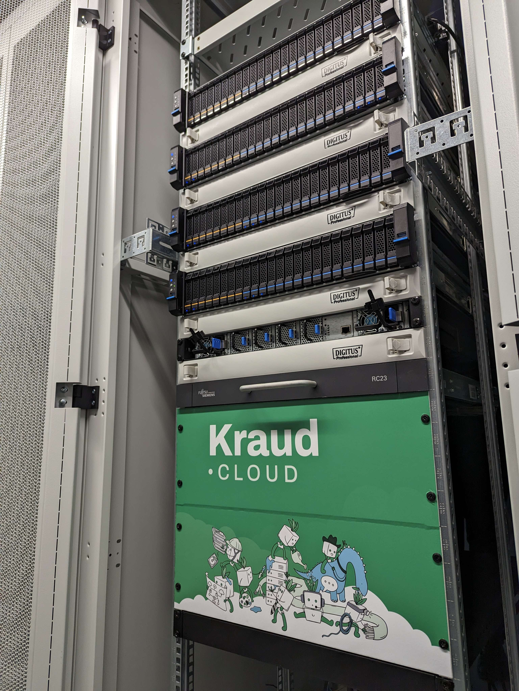

# get ready to move your pods to Berlin

## Backstory

Earlier this year we semi-announced the intention to move to a new datacenter location.
Kraud is on a mission to build carbon negative infrastructure, and the current datacenter provider
misrepresented the origin of their elecricity in a way that does not align with our values.

The new location is [3U Telecom](https://www.3utelecom.de/) in Berlin.
3U Holding, the parent company of 3U Telecom is heavily invested in renewable energy,
and we hope to have found a partner that shares our vision.

We also picked new network partners, [inter.link](https://inter.link) , [Core-Backbone](https://www.core-backbone.com/en/), and [BCIX](https://www.bcix.de/bcix/de/),
significantly increasing the connection quality of the new site.

We spent half a year building out the new site with an entirely new storage architecture based on ZFS.
The old site had extremly poor IOPS and frequent total cluster freezes due to bugs in ceph.
We can now offer LV2 storage with half a million IOPS, 
and automatic instant snapshots. A huge shift away from thinking first about compute to thinking first about storage.

The old site will be shut in July, so please prepare your workloads asap.

## TLDR

Moving pods with no storage attached is easy. Just delete the container and relaunch with the zone label `-l kr.zone=uca`. 
The site will become default in july, after which you need to specify `-l kr.zone=yca` to launch a pod in the legacy zone.

If you have storage attached, moving is slighly more involved. We currently recommend moving from rbd to lv2 and from gfs to nfs, as this will most likely match your expectations.

1. stop all pods
2. create a new volume with `docker volume create myvol --driver nfs`
3. copy all the files from the old to the new volume, for example by using [webdav](/quickstart/volumes/#webdav-access) or with docker exec, depending on your use case.
4. delete the old volume with `docker volume rm oldvol`
5. recreate your pods with `-l kr.zone=yca`

if you need assistance, don't hessitate to ask on [discord](https://discord.com/invite/wppeemfAn9) or send an email to support@kraudcloud.com

## Berlin is a huge step forward

with the new 100G infiniband SAN, we're starting a new chapter of thinking about storage as a primary feature.
Data is critical to all apps, and we want to make sure to offer a great experience in that regard too.

Being connected directly to an IXP also means we're now an actual proper datacenter with redundant paths to the internet
and high speed direct peering to a significant chunk of the European internet.

Finally, i personally live in Berlin, which of course had a huge impact on the choice of locations.
Having direct access to the machines enables me to run new and exciting new hardware features like GPU and risc-v.

If you're a free tier user or paid customer, i thank you for being on board this adventure.
I hope you're happy with our new site. Let me know if you have comments or feedback.

