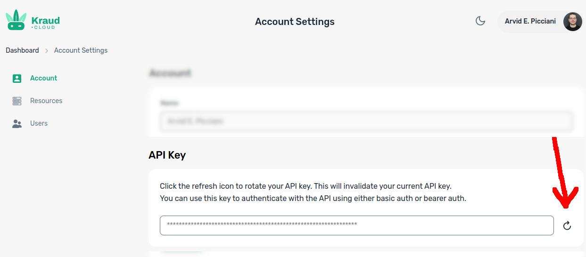

# Setup

kraud supports docker, swarm and compose at the same time in the same cluster.
You can mix and match the tools that best for your workflow.

If you came here looking for kubernetes, note that k8s compatbility is frozen and bugs will not be fixed.  Docker and the kra cli are actively managed, and we encourage you to give feedback on missing features.

To access the control plane, download the [latest cli from github](https://github.com/kraudcloud/cli/releases/)

Then head over to [https://kraudcloud.com](https://kraudcloud.com) to obtain an api key.
Note that clicking the refresh button invalidates any existing key you may have downloaded previously.




use the token to authenticate the cli

```bash
kra login $mytoken
```


then setup the docker remote context with

```bash
kra setup docker
```


## using the kraud remote context

=== "kra"

    kra is the official kraud cli and supports the most features

    ```bash
    kra user me
    ```

=== "docker"

    install the official docker cli from [https://docs.docker.com/get-docker/](https://docs.docker.com/get-docker/)

    most docker commands work on kraud, but the docker cli is somewhat limited.

    You can use docker context use to quickly switch between the kraud remote context and your local docker (default).
    for other methods, [see the official docs](https://docs.docker.com/engine/context/working-with-contexts/#use-a-different-context)

    ```bash
    docker context use kraud.myuser
    docker info
    docker context use default
    docker info
    ```

=== "compose"

    install the official docker cli from [https://docs.docker.com/get-docker/](https://docs.docker.com/get-docker/)

    most compose commands work on kraud, but the docker cli is somewhat limited.
    we generally recommend using kra instead.

    You can use docker context use to quickly switch between the kraud remote context and your local docker (default).
    for other methods, [see the official docs](https://docs.docker.com/engine/context/working-with-contexts/#use-a-different-context)

    ```bash
    docker context use kraud.myuser
    docker info
    docker context use default
    docker info
    ```

=== "swarm"

    install the official docker cli from [https://docs.docker.com/get-docker/](https://docs.docker.com/get-docker/)

    most swarm commands work on kraud, but the docker cli is somewhat limited.
    we generally recommend using kra instead.

    You can use docker context use to quickly switch between the kraud remote context and your local docker (default).
    for other methods, [see the official docs](https://docs.docker.com/engine/context/working-with-contexts/#use-a-different-context)

    ```bash
    docker context use kraud.myuser
    docker info
    docker context use default
    docker info
    ```


## starting your first pod/container

=== "kra"

    kra natively supports docker compose

    ```yaml title="docker-compose.yaml"
    version: "3.9"
    services:
      nginx:
        image: "nginx"
    ```
    
    ```bash
    kra up
    ```
=== "docker"

    ```
    docker context use kraud.myuser
    docker run -ti alpine
    ```

    alternatively, to only temporarily switch context:

    ```
    docker --context kraud.myuser run -ti alpine
    ```


=== "compose"

    ```yaml title="docker-compose.yaml"
    version: "3.9"
    services:
      nginx:
        image: "nginx"
    ```
    
    ```bash
    docker context use kraud.myuser
    docker compose up
    ```

=== "swarm"

    ```yaml title="docker-compose.yaml"
    version: "3.9"
    services:
      nginx:
        image: "nginx"
    ```
    
    ```bash
    docker context use kraud.myuser
    docker stack deploy -c ./docker-compose.yaml mystack
    docker stack ls
    ```
