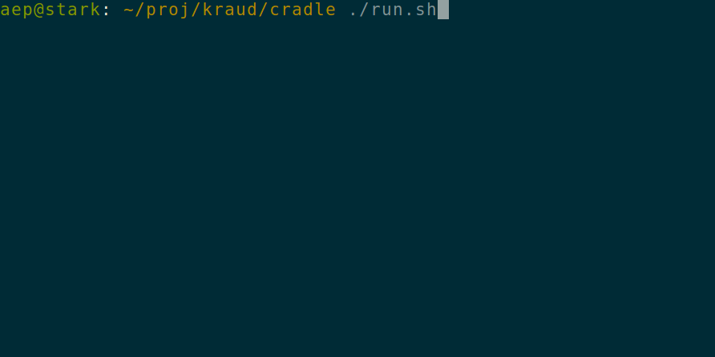

> "the cloud is just someone elses computer"

A thing people do with the cloud is that they rent virtual computers.
This is convenient because you want the control and fun of installing a computer, but not the noise and responsibility of cleaning the fans all the time, yuck! Is this a good deal? I don't know. [For who anyway?](https://duckduckgo.com/?q=bezos+yacht).

Self hosting is key to Krauds mission of bringing the cloud home. That plus the primary mission of energy (and price) efficiency does mean we do not rent out computers. That's ok, someone else will gladly run a [money furnace](https://www.statista.com/statistics/1243513/top-10-cloud-vendors-by-revenue-fiscal-quarter-global/) for you. Read more about energy in [the  mission statement](/mission/)

## microvms

What we do rent out are dynamic compute slots for microvms. You might have heard of [amazon firecracker](https://firecracker-microvm.github.io/)
claiming sub 125ms startup. Cool, but...

Ah yes that's booting up a vm **and** a docker container in 100ms, no problem!

There's so much more to unpack here. Kraud Cradle is more akin to AWS Nitro Enclaves with encrypted memory,
except that Nitro Enclaives have their trust anchor in the cloud  (bigcloud always finds a way, haha) and cradle is open source so you can just bring your own trust anchor. (see [confidential compute](/technology/confidential/))

This is key to energy efficiency, since alot of times people leave servers running idle, in case someone might need them. Super embarrassing if you have your first visitor and the website takes a minute to load (good old Heroku times).

## docker run cloud

When reading the [quickstart guide](/quickstart/setup/) you noticed we support docker, docker compose, docker swarm, and kubernetes. Those are all standards and nothing really new here. That's intentional, to keep the barrier of entry low, but also the barrier of exit. 

Bring your existing stuff, it'll all work fine. Or leave with all your stuff and do the devops yourself at any time.

> "A docker cloud is just someone elses dockerd"

Well, in a way? But firstly, we're not actually using kubernetes, or docker, or anything really. We just fake the api for your convenience. Pods (containers) are actually implemented as micro-vms to enable multi tenancy without having to waste energy for an entire control plane.

If you're used to kubernetes, this may be confusing because some endpoints don't actually return data in a way you would expect from a kubernetes cluster, because well,

*there is no kubernetes cluster*

and if you're used to your docker this maybe also confusing because you might assume you're just connected to someone elses docker. 

## macro economics

But really, you're connected to what we call macro. A replicated state engine similar to [google borg](https://research.google/pubs/pub43438/).
That's again similar to how k8s operates, but the similarities are inspirational only. K8s builds a platform on on a cloud, while macro *is* the cloud. 

This is an important semantic difference. All container managment platforms are built on the idea of orchestrating VMS and *then* slicing them into containers. So you always overallocate. That's very useful if you are, let's say a big cloud and coincidentally the biggest donor to all the popular container orchestrators.

In the spirit of removing layers for efficiency, Kraud does not preallocate anything to provide you a cluster. There is no cluster. 

The only two things between you and the hardware exist to 1. make sure stuff still runs when the hardware fails. 2. isolate your container from other tenants containers

