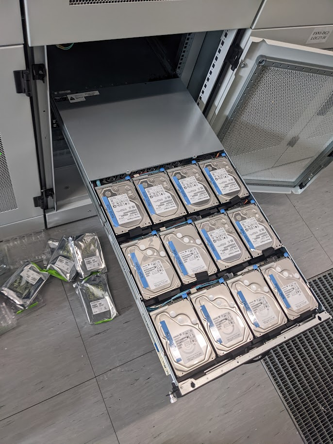

> persistence is key to success

i'm sure they don't mean disk persistence, but it's true anyway. Persistence, as in, saving stuff to some place where it won't get lost, is after all the consumer perspective of a cloud. The cloud is where the cat pics live!

Kraud uses multiple storage backends, depending on what [you tell it to do](/quickstart/volumes/).

I don't have a cat, so here's a picture of 180TB of cat archives

