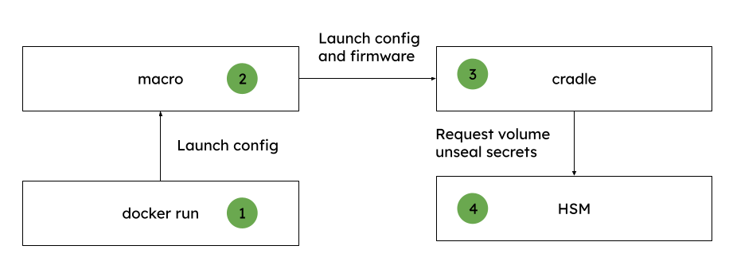

> persistence is key to success

i'm sure they don't mean disk persistence, but it's true anyway. Persistence, as in, saving stuff to some place where it won't get lost, is after all the consumer perspective of a cloud. The cloud is where the cat pics live!

Kraud uses multiple storage backends, depending on what [you tell it to do](/quickstart/volumes/).

## encrypted volumes

Here's roughly how disk encryption works

1. a user calls docker run, requesting an image with a specific configuration to be launched
2. macro builds launch package (layers, secrets, volumes) and selects an available hardware
3. cradle (inside vm) executes launch config and starts containers
4. cradle asks HSM for LUKS decryption keys to volumes and secrets

## archives

I don't have a cat, so here's a picture of 180TB of cat archives

